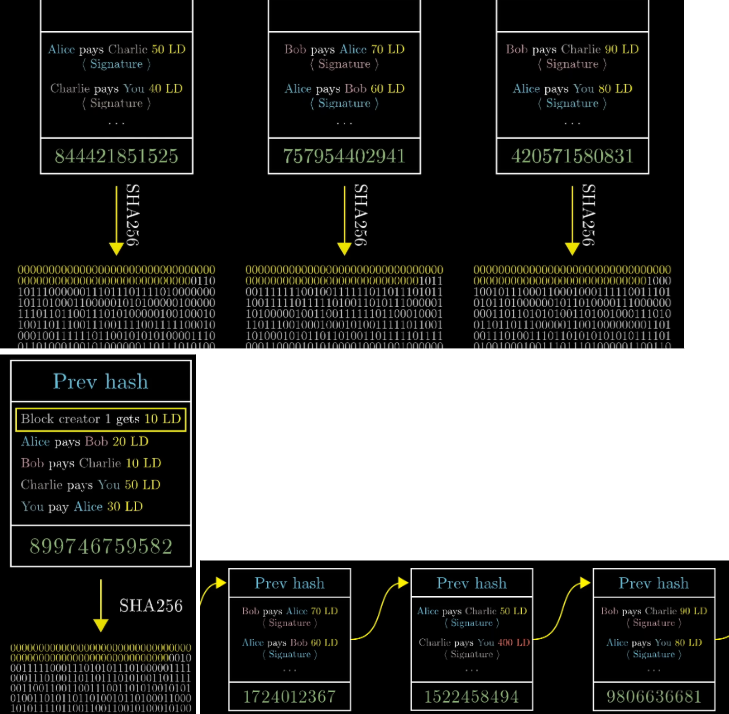
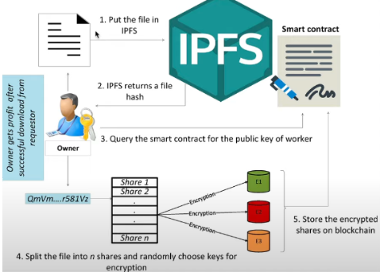
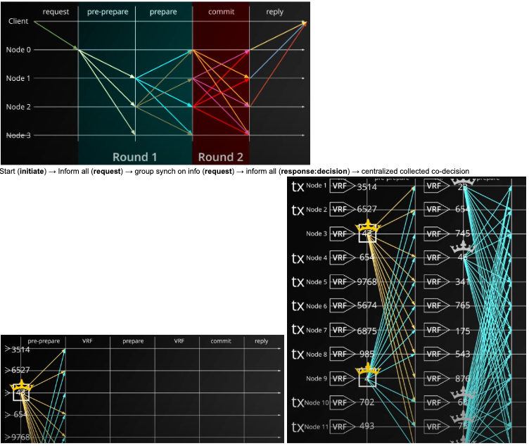

# Blockchain Simple Learning Demo

The first transaction in a block is a transaction that starts a new coin owned by the creator of the block. This adds an incentive for nodes to support the network, and provides a way to initially distribute coins into circulation, since there is no central authority to issue them. The steady addition of a constant amount of new coins is analogous to gold miners expending resources to add gold to circulation. In our case, it is CPU time and electricity that is expended. The incentive can also be funded with transaction fees. If the output value of a transaction is less than its input value, the difference is a transaction fee that is added to the incentive value of the block containing the transaction. Once a predetermined number of coins have entered circulation, the incentive can transition entirely to transaction fees and be completely inflation free. The incentive may help encourage nodes to stay honest. If a greedy attacker is able to assemble more CPU power than all the honest nodes, he would have to choose between using it to defraud people by stealing back his payments, or using it to generate new coins. He ought to find it more profitable to play by the rules, such rules that favor him with more new coins than everyone else combined, than to undermine the system and the validity of his own wealth.

* Every time someone creates a transaction, they are the block creator. 

The miner will broadcast the answer. To get a reward, s/he appends a term before s/he starts mining. This also mints new currency amount.  
* Miners not demonstrated in this learning segment. 

<b>Note</b>
```
Visa: avg: 1700 tps, >24000 tps; bitcoin block size: 2400 transaction limit.
Mempool (transaction pool): list of outstanding transaction which have been broadcast but not in blockchain yet.
With more than 51%, attacker has higher chance to win the game, suppress mempool transaction selection and create double spending fraud and change rules of consensus.

BTC consensus: ledger append-only, decentralism, validation via miners and PoW 

Nodes can broadcast their presence on a predefined port and in a predefined message format. Other nodes can be listening on this port, so that they "catch" the message from a new node (broadcasting their presence). To connect to a known peer, nodes establish a TCP connection, usually to port 8333 (the port generally known as the one used by bitcoin), or an alternative port if one is provided. Any individual can become a node and start participating in the network. There is no oversight over who can join, or how many nodes can you create. All your transactions are recorded on the main-net and visible to everyone. In ETH  blockchain, there are so called "bootnodes". Their only task is to welcome new nodes and let them meet the other nodes on the network. These bootnodes have a static IP address and a list of all nodes running in the network. When you start a new node it can ask a bootnode for all the nodes in the network, to become a new member of the blockchain network.

Some clients also have a predefined list of trusted nodes that are usually maintained by the network core development team or some other trusted groups, so that the client doesn't have to wait for other nodes to broadcast their presence and can communicate with these trusted nodes right away.
```



<b>Advantage</b>
```
Finality: On-chain payments made offer near-instant finality. Merchants don’t have to worry about canceled customer payments due to insufficient funds or other reasons.

24/7 availability.
```

<b>Innovations yet-to-be</b>
```
Near-instant settlement.

Interoperability: available for payments outside of the service provider, offering interoperability with other processors, networks, and wallets.

Programmability and composability: Developers can freely experiment and build on top of the digital currency both inside and outside of the service provider ecosystem. Consumers, merchants, and institutions can enjoy a wide range of third-party developer experiences that leverage it for payments and financial use cases.

Low transaction costs

Non-exclusive

Easy on and off ramps

Counterfraud and user safety and protection

Node trust management and coordination 

Simple and clear actions like transaction should spell transaction purpose clearly in action (not leaving interpretation based on the inference of the params). Instead of non-intuitive option modes like is "23", “params "0 16"?”, “... add-cancel ... '0'” (what is the param "0" at the end?), etc, make it explicit instead of creating redundant look-up.
e.g. --redelegate/transfer_ownership, --transfer_funds, --add_ownership, etc. 

**Reason** : Ambiguity and confusion can be a cause of security risks. Be explicit and conserve energy focus for humans. 

Trust and entrust membership management.
"""
--approve or --deny or --revoke must come with clear option just as before, i.e.  --redelegate/transfer_ownership, --transfer_funds, --add_ownership, etc. 
"""

Safe an secure (de-)Fragmentation / (de-)composition of smart contracts and data storage.
```


<b>Note on Byzantine Fault Tolerant Systems</b>

```
Start (initiate) → Inform all (request) → group synch on info (request) → inform all (response:decision) → centralized collected co-decision 

PBFT: 
Request (node 0) - announce (node 0) - synch (ensure announcement) - commit - finalize (reply)

Byzantine fault tolerance (a.k.a. BFT) is a system that operates normally within a byzantine failure model. However, even BFT does not operate when there exist numerous faulty nodes. The amount of faulty nodes that can be tolerated must be mentioned. For example, if N = 5f, even if ⅕ of the nodes suffer from byzantine failure, the entire system operates properly. Likewise, if N=3f+1, ⅓ of the nodes could suffer from byzantine failure and the entire system will still operate with no issues. 
* assume N only fulfills 1 role or function or service for the blockchain
* for a functional role, s/he must be backed by 3 other

2 faults:
-not sending a message at all. 
-node in byzantine failure maliciously sends different messages

for N nodes to function properly while having f nodes suffering from byzantine failure, a consensus has to be reached with N — f messages, i.e. N — f nodes are required for quorum. 
say that among the N — f nodes that achieved quorum, f were sent by byzantine failure. Even in this case, the system has to operate normally, and thus (N — f) — f messages must > f messages (sent by nodes suffering from byzantine failure).
to resolve the 2 problems above, (N — f) — f > f. N > 3f, which means when there are f nodes that has a byzantine failure, there has > 3 f nodes in order for the system to be byzantine fault tolerant. The smallest N value is 3f + 1. Thus, in a system that is made up of 3f + 1 nodes, the greatest amount of faulty nodes that can exist is f. 

```



